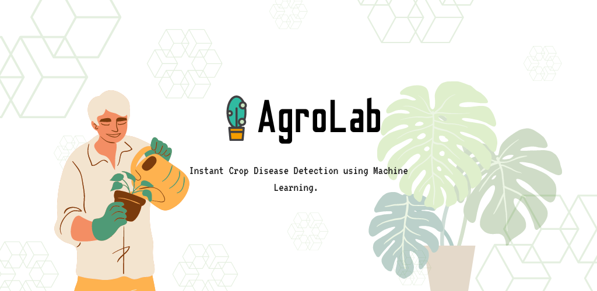
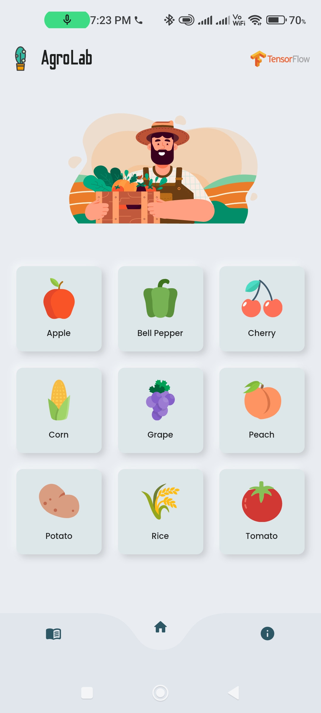
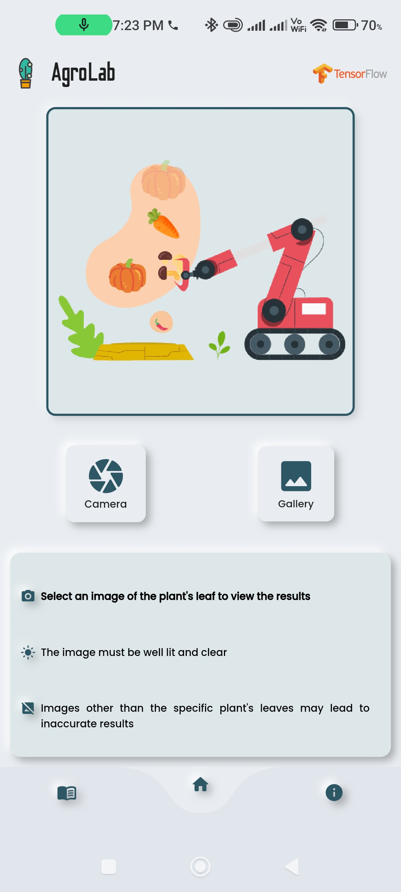
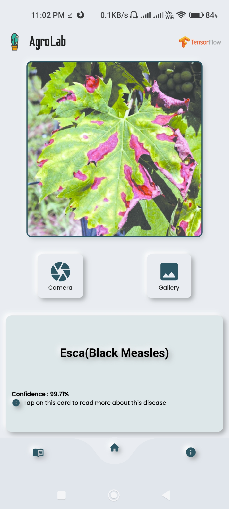
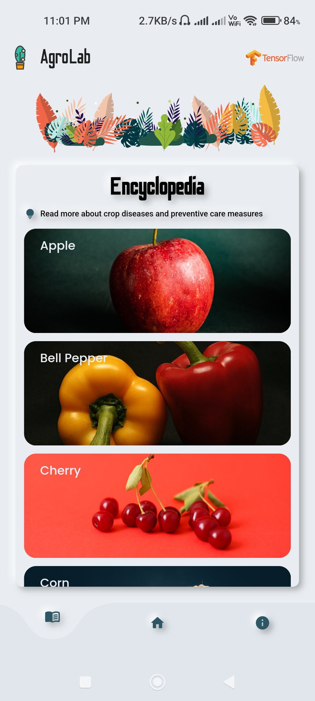

# AgroLab

An Android app for plant disease detection using Machine Learning, with a clean and minimal user interface.

## Tech Stack

  

## Screenshots

## Features

- Supports a variety of crops
- Clean and intuitive user interface
- Individual trained machine learning models for each crop for improved accuracy
- Super-quick scan results 
- Want to learn more about plant diseases and care? The Encyclopedia section in the app does just that!

## Team

<table id='team'>
<tr>
<td id='Sagar Paul'>

<h4 align='center'><a href='https://github.com/sagar-alias-jacky'>Sagar Paul</a></h4>
</td>
<td id='Paul G Tharayil'>

<h4 align='center'><a href='https://github.com/paul1947'>Paul G Tharayil</a></h4>
</td>
<td id='Varun C'>

<h4 align='center'><a href='https://github.com/varunc20101'>Varun C</a></h4>
</td>
<td id='Nihal James Manoj'>

<h4 align='center'><a href='https://github.com/Blieve4ever'>Nihal James Manoj</a></h4>
</td>
</table>

## Feedback and Questions

Have a question, or want to provide feedback? Visit the [Issues Page](https://github.com/github/feedback/discussions/categories/copilot-feedback)
to ask questions, share bugs. For feedback email sagarpaul.dev@gmail.com.
